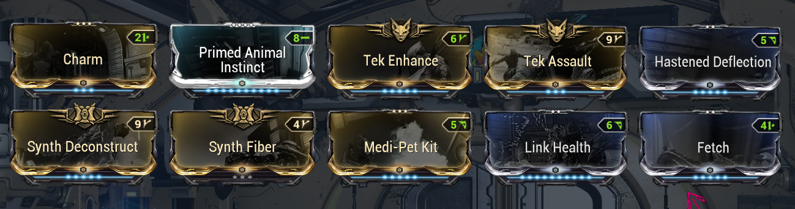

*This guide was created for and by the [Warframe Arbitrations](http://discord.gg/d2ubNDSv8a) Discord community.*

*You are very welcome to join us, get notified about the current Arbitration, ask questions, discuss strategies, or find a group to run with.*

*[http://discord.gg/pANbkkNc5Z](http://discord.gg/pANbkkNc5Z)*





# Frames

These build recommended here will work perfectly fine for 80-100 waves in defense, anything above that might be a bit risky. They’re relatively lower-investment builds with 4 forma each so you don’t have to forma every frame 7-8 times. You can opt for umbral intensify for more power strength eventually when you can commit more formas to the builds. 

More advanced builds will follow later.






# Weapons





## General Weapon Advice 
Don't forget to upgrade your normal mods to primed versions when you can.

### Secondary Advice 
If you have Amalgam Barrel Diffusion, make sure to pop it on whatever secondary you’re running as it gives a good parkour velocity boost when you’re rolling which really helps with looting fast.

# Companions
## Smeeta Kavat
Can potentially be very good and help boost Vitus essence anywhere from 10% to 50% in a good run, always run this if you have it. 
Charm, Animal instinct, Tek Enhance and Fetch are the mandatory mods, Tek assault is optional but can be very nice to have.

### Basic Build

# Extra items + Specters
Having energy restore pads and ammo restore pads can come in clutch sometimes as well so make sure you’re stocked up on plenty of those. You can get 100x restore blueprints from the different labs in the dojo. The specters used are Ancient healer specter, nidus specter and protea specter. The weapons on them don’t really matter as you’ll really just be using them for their abilities. Protea for Dispensary and Nidus for Parasitic Link just make sure to make them stationary where you’ll be camping. The quality of the specter also does not matter as a 1 star specter will functionally be the exact same as a 4 star specter so make sure to use whichever ones you have.

# Recommended Warframe Settings
For the map

For whatever frame you’re hating to hold abilities (ex. Vauban)

To save your eyes really

# Nodes, Tiles and Mission Types

For your convenience, the best tiles have been sorted into the S-Tier and A-Tier category and you can simply pick up the roles to get pinged for these in the server.

Mission types : 
Interception and defense are the best mission types to farm Vitus essence. Defense is simple enough (camp one point and shoot at spawns) and there is an example video at the bottom of this guide.

For interception you want to make sure the rounds go on for as long as possible so you can do much longer runs as enemies will scale much much more slowly. To achieve this, you’ll want to capture TWO points at the start of the round and neutralize one other point. Once your progress is 2% higher than the enemy you can let the neutralized point get captured back again and proceed to return to the camp point and shoot at spawns until next round. Be careful not to get distracted and let enemies capture any of your points after that though. Make sure to coordinate with your team about who will cap and who will neutralize at the start of runs to make things easier.

# Double Dipping (DD) 
## How to run the same mission twice
Some arbitrations are just better than others. Sometimes the map is better so you can shoot at spawns without there being walls and obstructions which leads to higher kills per minute which leads to getting more Vitus essence and there’s no guarantee that the next Arbitration map will be just as good. This is why DD or Double Dipping is so important as it allows you to play the same map twice.

To achieve this players need to party up and all join a relay together. Once in the relay you’ll have to try and get a resource booster blessing either from a kind stranger or from someone in your party whose mastery rank 30 for more loot. 
 

Everyone will then LEAVE the relay and make a party again. You will then join a relay again and start the arbitration from the navigation area of the relay. Make sure to leave 5-10 minutes before the arbitration ends. Once you’re back in the relay you’ll be able to select the arbitration mission again and do a full long run of it and it’s that simple to double dip. Make sure you don’t leave the relay or join a different relay after finishing your first arbitration run as you’ll lose the ability to play the mission again.

The only map that you can’t double dip well is the frozen world corpus one as you can get a random selection between 3 maps when you load into that and only one of the maps is good. 

# Example video : 

Here are defense and interception example videos of the arbitration gameplay loop as mirage, it’s pretty much the same for all other roles as well

Defense:  [https://www.youtube.com/watch?v=OB6srluQdXA](https://www.youtube.com/watch?v=OB6srluQdXA)
Interception: [https://www.youtube.com/watch?v=dDERzXZsaec](https://www.youtube.com/watch?v=dDERzXZsaec)
