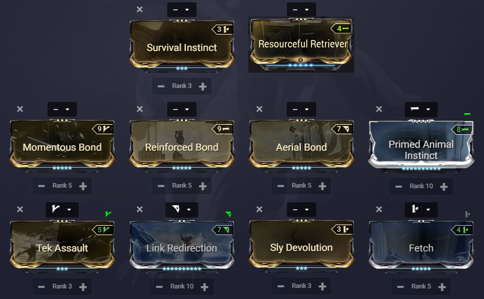
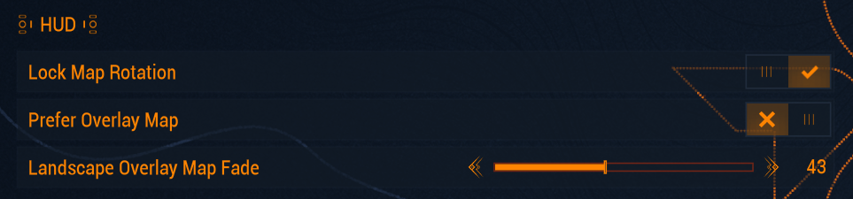
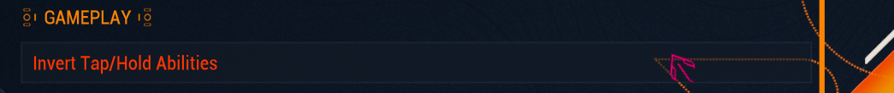
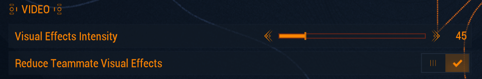

*This guide is currently a simplified beginner-friendly guide for people trying to get into arbitrations

*It is created for and by the [Warframe Arbitrations](http://discord.gg/d2ubNDSv8a) Discord community.*

*You are very welcome to join us, get notified about the current Arbitration, ask questions, discuss strategies, or find a group to run with.*

*[http://discord.gg/pANbkkNc5Z](http://discord.gg/pANbkkNc5Z)*





# Frames

These build recommended here will work perfectly fine for 80-100 waves in defense, anything above that might be a bit risky.

If you are just getting into Meta Arbitrations it is recommended to start out with either Wisp or Chroma since they have the lowest skill requirement. 
Saryn and Mirage should only be played by more experienced players since almost everything relies on them performing well.  
{: .important }







# Weapons






## General Weapon Advice 

### Secondary Advice 
If you have [Amalgam Barrel Diffusion], make sure to pop it on whatever secondary you’re running as it gives a good parkour velocity boost when you’re rolling which really helps with looting fast.
# Companions
You can run any beast companion with the [Resourceful Retriever] mod equiped, but bond mods can give additional utility.

## Sly Vulpaphyla
Sadly Martyr Symbiosis doesn't work in Arbi's, but the Sly Vulpaphyla also has [Survival Instinct] which basically gives you a mini Wisp passive boosting your survivability while looting a bit.
Remember to equip bite on your beast companion if you want Tenacious Bond to work. 

### Companion Build

This build is optional, but it gives some nice additional buffs and helps a bit with survivability.

# Gear
Having [Energy Restore Pads] and [Ammo Restore Pads] can come in clutch sometimes as well so make sure you’re stocked up on plenty of those. You can get 100x restore blueprints from the different labs in the dojo. 

The ability of the [Mantis] Landing Craft is also nice to have since it summons a Life Support Capsule on which you can stand on. So you can shoot from a more elevated Position.

## Specters
The specters used are Ancient Healer Specter and [Nidus] Specter for [Parasitic Link] just make sure to make them stationary where you’ll be camping. The quality of the specter also does not matter as a 1 star specter will functionally be the exact same as a 4 star specter so make sure to use whichever ones you have.

Mods do not apply to Specters
{: .reminder }

For weapons ensure you use [Battery Weapons] like the Shedu and Cycron on them so that they don't take ammo away from you. Besides that weapon choice doesn't really matter as you’ll really just be using them for their abilities. 

# Recommended Warframe Settings
For the map

For whatever frame you’re hating to hold abilities (ex. Vauban)

To save your eyes really

# Nodes, Tiles and Mission Types

For your convenience, the best tiles have been sorted into the S-Tier and A-Tier category and you can simply pick up the roles to get pinged for these in the server.
The Tier of a node is simply decided by the possible vitus essence per hour (VE/h). 
Survival, disruption and other "Open tile" missions have the issue of way too spread out uncontrollable spawns resulting in drones getting stuck in random locations, resulting in 1 less possible drone for the rest of the mission and way lower KPM (kills per minute). 
People usually only play S and A Tier arbitrations, some still play B tier missions but i wouldn't expect to find lobbies for anything below S/A-Tier.

## Mission types 
Interception and Defense are the best mission types to farm Vitus essence. Defense is simple enough (camp one point and shoot at spawns) and there is an example video at the bottom of this guide.

For interception you want to make sure the rounds go on for as long as possible so you can do much longer runs as enemies will scale much much more slowly. To achieve this, you’ll want to capture TWO points at the start of the round and neutralize one other point. Once your progress is 2% higher than the enemy you can let the neutralized point get captured back again and proceed to return to the camp point and shoot at spawns until next round. Be careful not to get distracted and let enemies capture any of your points after that though. Make sure to coordinate with your team about who will cap and who will neutralize at the start of runs to make things easier.

# Double Dipping (DD) 
## How to run the same mission twice
Some arbitrations are just better than others. Sometimes the map is better so you can shoot at spawns without there being walls and obstructions which leads to higher kills per minute which leads to getting more Vitus essence and there’s no guarantee that the next Arbitration map will be just as good. This is why DD or Double Dipping is so important as it allows you to play the same map twice.

To achieve this players need to party up and all join a relay together. Once in the relay you’ll have to try and get a resource booster blessing either from a kind stranger or from someone in your party whose mastery rank 30 for more loot. 
 

Everyone will then LEAVE the relay and make a party again. You will then join a relay again and start the arbitration from the navigation area of the relay. Make sure to leave 5-10 minutes before the arbitration ends. Once you’re back in the relay you’ll be able to select the arbitration mission again and do a full long run of it and it’s that simple to double dip. Make sure you don’t leave the relay or join a different relay after finishing your first arbitration run as you’ll lose the ability to play the mission again.

The only map that you can’t double dip well is the frozen world corpus one as you can get a random selection between 3 maps when you load into that and only one of the maps is good. 

[Saryn]: #saryn
[Mirage]: #mirage
[Volt]: #volt
[Wisp]: #wisp
[Chroma]: #chroma
[Kuva Ogris]: #kuva-ogris
[Afentis]: #afentis
[Sporelacer]: #sporelacer
[Smeeta Kavat]: #smeeta-kavat
[Specters]: #specters
[Arbitrations]: https://warframe.fandom.com/wiki/Arbitrations
{:target="_blank"}
[Arbitration Shield Drone]: https://warframe.fandom.com/wiki/Arbitration_Shield_Drone
{:target="_blank"}
[Vitus Essence]: https://warframe.fandom.com/wiki/Vitus_Essence
{:target="_blank"}
[Nightwatch Napalm]: https://warframe.fandom.com/wiki/Nightwatch_Napalm
{:target="_blank"}
[Amalgam Barrel Diffusion]: https://warframe.fandom.com/wiki/Amalgam_Barrel_Diffusion
{:target="_blank"}
[Charm]: https://warframe.fandom.com/wiki/Charm
{:target="_blank"}
[Animal instinct]: https://warframe.fandom.com/wiki/Animal_instinct
{:target="_blank"}
[Tek Enhance]: https://warframe.fandom.com/wiki/Tek_Enhance
{:target="_blank"}
[Fetch]: https://warframe.fandom.com/wiki/Fetch
{:target="_blank"}
[Energy Restore Pads]: https://warframe.fandom.com/wiki/Squad_Energy_Restore
{:target="_blank"}
[Ammo Restore Pads]: https://warframe.fandom.com/wiki/Squad_Ammo_Restore
{:target="_blank"}
[Protea]: https://warframe.fandom.com/wiki/Protea
{:target="_blank"}
[Dispensary]: https://warframe.fandom.com/wiki/Dispensary
{:target="_blank"}
[Nidus]: https://warframe.fandom.com/wiki/Nidus
{:target="_blank"}
[Parasitic Link]: https://warframe.fandom.com/wiki/Parasitic_Link
{:target="_blank"}
[Grendel]: https://warframe.fandom.com/wiki/Grendel
{:target="_blank"}
[Nourish]: https://warframe.fandom.com/wiki/Nourish
{:target="_blank"}
[Toxic Lash]: https://warframe.fandom.com/wiki/Toxic_Lash
{:target="_blank"}
[Gauss]:https://warframe.fandom.com/wiki/Gauss
{:target="_blank"}
[Thermal Sunder]: https://warframe.fandom.com/wiki/Thermal_Sunder
{:target="_blank"}
[Rhino]:https://warframe.fandom.com/wiki/Rhino
{:target="_blank"}
[Roar]:https://warframe.fandom.com/wiki/Roar
{:target="_blank"}
[Power Donation]:https://warframe.fandom.com/wiki/Power_Donation
{:target="_blank"}
[Enemy Radar]:https://warframe.fandom.com/wiki/Enemy_Radar
{:target="_blank"}
[Battery Weapons]:https://warframe.fandom.com/wiki/Category:Battery_Weapons
{:target="_blank"}
[Energized Munitions]:https://warframe.fandom.com/wiki/Category:Energized_Munitions
{:target="_blank"}
[Thermal Transfer]:https://warframe.fandom.com/wiki/Thermal_Transfer
{:target="_blank"}
[Arcane Power Ramp]:https://warframe.fandom.com/wiki/Arcane_Power_Ramp
{:target="_blank"}
[Molt Vigor]:https://warframe.fandom.com/wiki/Molt_Vigor
{:target="_blank"}
[Archon Intensify]:https://warframe.fandom.com/wiki/Archon_Intensify
{:target="_blank"}
[Infected Clip]:https://warframe.fandom.com/wiki/Infected_Clip
{:target="_blank"}
[Mantis]:https://warframe.fandom.com/wiki/Mantis
{:target="_blank"}
[Praedos]:https://warframe.fandom.com/wiki/Praedos
{:target="_blank"}
[Resourceful Retriever]:https://warframe.fandom.com/wiki/Resourceful_Retriever
{:target="_blank"}
[Survival Instinct]:https://warframe.fandom.com/wiki/Survival_Instinct
{:target="_blank"}